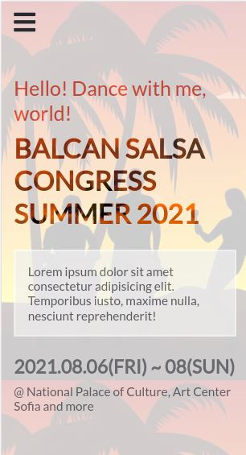

# Latin dance page

> Webpage for salsa congress.

## Built With

- JavaScript
- HTML
- CSS

## Getting Started

To get a local copy up and running follow these simple example steps.

## Live Demo

[Live Link](https://polinastamenova.github.io/Capstone-Latin-dance-page/)

## Video Demo

[Video Link](XXXXXXXXXXXXXXXX)

## Instructions

To get a local copy up and running follow these simple example steps.

$ cd <folder>

$ git clone git@github.com:PolinaStamenova/Capstone-Latin-dance-page.git

### Install

- Set up liveserver as an extension in your VS Code.
- If you dont have the live server extension, or are using another software just view directly in your browser.

### Usage

- Right click and open the index.html in your browser to view.

## Authors

👤 **Polina Stamenova**

- GitHub: [@githubhandle](https://github.com/PolinaStamenova)
- LinkedIn: [LinkedIn](https://www.linkedin.com/in/polina-stamenova-a60766112/)

## 🤝 Contributing

Contributions, issues, and feature requests are welcome!

Feel free to check the [issues page](https://github.com/PolinaStamenova/Capstone-Latin-dance-page/issues).

## Show your support

Give a ⭐️ if you like this project!

## Acknowledgments

- Microverse
- Creative Commons
